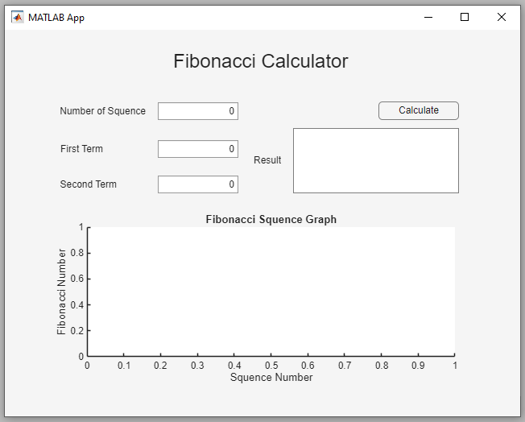
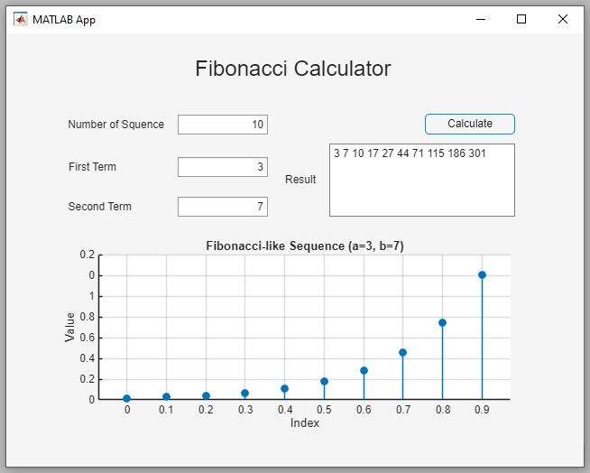
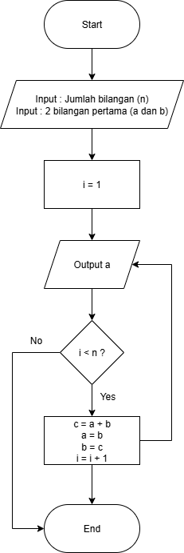

## Fibonacci Calculator with MATLAB App Designer

Fibonacci Calculator is an educational project demonstrating the implementation of recursive algorithms with a graphical user interface in MATLAB App Designer. Users can input the number of terms as well as custom starting values to generate the Fibonacci sequence, which is then displayed in both text and plot format. The repository includes:
- Source code (.mlapp and .m files)
- A structured LaTeX report with references and figures
- Flowcharts illustrating algorithm and UI workflows
- Screenshots for UI and results preview
This project highlights the integration of algorithm computation, user-friendly interface design, and visualization as a teaching tool in algorithm and computation courses.

---

## 📂 Repository Structure
Fibonacci-Calculator/
- `src/` : MATLAB source code (`.mlapp` and `.m` files).
- `preview/` : Screenshots and flowcharts used in the report.

---

## 🚀 Features
- Support for **Classic mode** (0,1) and **Custom mode** (a,b).
- **Error handling** for invalid inputs (e.g., n < 1).
- Clean UI/UX design with MATLAB App Designer.

---

## 📖 User Manual
1. Open `Fibonacci_calculator.mlapp` in MATLAB App Designer (tested on MATLAB R2025a).
2. Enter the number of sequence terms (`n`).
3. Enter the first two terms (`a` and `b`).
4. Select the mode (Classic or Custom).
5. Click **Calculate**.
6. View the results in:
   - **Result Text Area** (numerical sequence)
   - **Graph Panel** (visualization of sequence growth)

---

## 🖼️ Preview

| UI Preview | Result Preview |
|------------|----------------|
|  |  |

---

## 🔎 Flowcharts

| Basic Fibonacci Algorithm | App Designer with UI |
|---------------------------|----------------------|
|  |  |

---

## 🛠️ Requirements
- MATLAB R2023a or later (tested with MATLAB R2025a).
- MATLAB App Designer toolbox.
- Basic knowledge of running `.mlapp` files.

---

## 📚 References
- Vajda, S. *Fibonacci and Lucas Numbers, and the Golden Section*. Dover, 1989.  
- Knuth, D. *The Art of Computer Programming*. Addison-Wesley, 1997.  
- Cormen, T. H., et al. *Introduction to Algorithms*. MIT Press, 2009.  
- MathWorks Documentation: [MATLAB App Designer](https://www.mathworks.com/help/matlab/app-designer.html)

---

## 👤 Author
- Sri Kusmiyati 
- Course: **Algoritma dan Komputasi**  
- Teacher: **Muhammad Qomaruz Zaman**  
